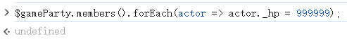
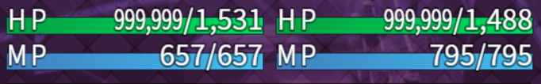
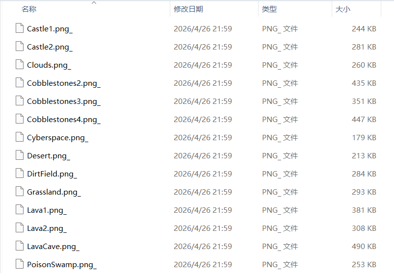
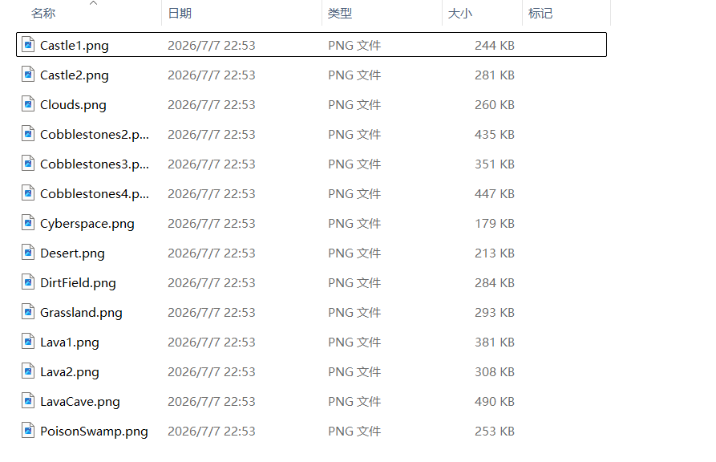

# RPG Maker 游戏启动器

基于 NW.js 的游戏启动管理工具, 支持绝大多数 RPG Maker 制作的游戏.

## 功能

- 游戏启动管理
- 控制台调试
- 资源解密

## 如何使用

1. 将本项目下载到本地.
2. 前往[https://nwjs.io/](https://nwjs.io/) 下载 NW.js 桌面版, 推荐下载 SDK 版本.
3. 解压下载后的压缩包至本项目目录, 确保 ``nw.exe`` 与 ``package.json``, ``menu/`` 同级.
4. 双击 ``nw.exe`` 启动项目, 会自动创建 ``games`` 文件夹.
5. 将 RPG 游戏的 ``www`` 文件夹复制到 ``games`` 文件夹中, 并命名为游戏名称.
6. 再次双击 ``nw.exe`` 启动项目, 即可在启动器中查看游戏列表.

## 支持的功能

### 控制台调试

拦截游戏对开发环境的检测, 屏蔽 ``exit()`` 函数与一些监听事件, 伪造可信环境. 可使用 ``F12`` 打开控制台, 并执行任意 JavaScript 代码, 以实现自定义修改, 例如修改金钱、HP 等.

例如以下代码可以修改全角色生命值:
```js
$gameParty.members().forEach(actor => actor._hp = 999999);
```

| 控制台调试 |
|:--------:|
|  |
|  |

### 存档编辑 (网页)

右键游戏卡片, 可快速打开网页版游戏档编辑器, 自行上传存档进行编辑.

### 资源解密

自动查找密钥, 并解密游戏目录下 ``img`` 文件夹中的全部文件至 ``img_decrypt`` 文件夹. 若未加密, 则转而直接打开 ``img`` 文件夹.

|              解密前              |                 解密后(可正常打开)                 |
|:-----------------------------:|:-----------------------------------:|
|  |  |

## 常见问题

### 游戏目录下没有 ``www`` 文件夹

部分游戏直接将资源放在根目录, 请检查是否存在下列文件或文件夹:

```
game_root/
    ├── audio/
    ├── data/
    ├── fonts/
    ├── icon/
    ├── img/
    ├── js/
    ├── save/
    ├── index.html
    └── package.json
```

若存在, 直接将这些文件复制到 ``games/<game_name>/`` 中, 即可正常启动游戏. 部分游戏可能有更多的资源文件, 请自行检查与尝试.

若不存在, 说明该游戏可能并非 RPG Maker 游戏.

### 提示找不到某某文件, 但文件实际上存在

大概率是游戏拥有严格的作弊检测, 如某游戏会检测窗口大小, 启动器大小, 特征码等, 仅仅是切换启动器便会触发检测. 检测机制通常会捆绑在正常代码中, 难以自动化去除.

故障原因:

> 检测代码通常会包含在资源加载代码中, 并在检测到异常情况时, 通过 ``process.exit()`` 结束游戏, 但由于启动器拦截了该函数, 导致游戏无法主动关闭. 而资源加载又因此中断, 故提示找不到某某文件, 但文件实际上存在.

推荐的解决方法: 

1. 在游戏文件中检索 ``process.exit`` 字符串, 正常游戏流程中不应该出现该调用, 一般仅用于检测到作弊时退出游戏.
2. 将该函数所在的代码或完整函数发给 AI (推荐 Gemini), 提示词如下: 
> 我尝试使用 nw.js 启动 RPG Maker 制作的游戏, 但游戏中存在对调试环境的检测, 例如检测控制台是否启动, 某个自定义字段是否符合等. 请你阅读这段代码, 告诉我这段代码实现了什么功能, 以及它是如何实现检测的. 随后, 请尝试只删掉检测的部分, 保留必要的代码, 以确保游戏的正常运行. 代码如下: \<code\>
3. 根据 AI 回复, 替换游戏文件中的检测代码.
